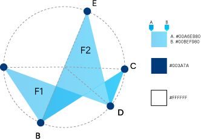

#### Raio Círculo de Referência
R1 = 1

#### Formas

F1 = A,B,C,D,A
F2 = B,C,D,E,B

#### Raio dos círculos com centro em A, B, C, D e E

R2 = 0,06

#### F1
Gradiente com 50% de transparência cores A e B
#00A6EB80
#00BEF980

#### Círculos com centro em A, B, C, D e E
#003A7A

#### Círculo de Ref. 

#FFFFFF
